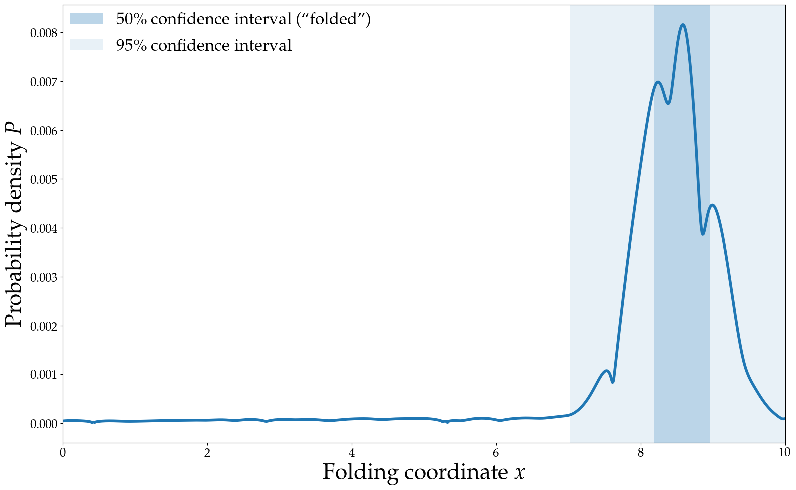
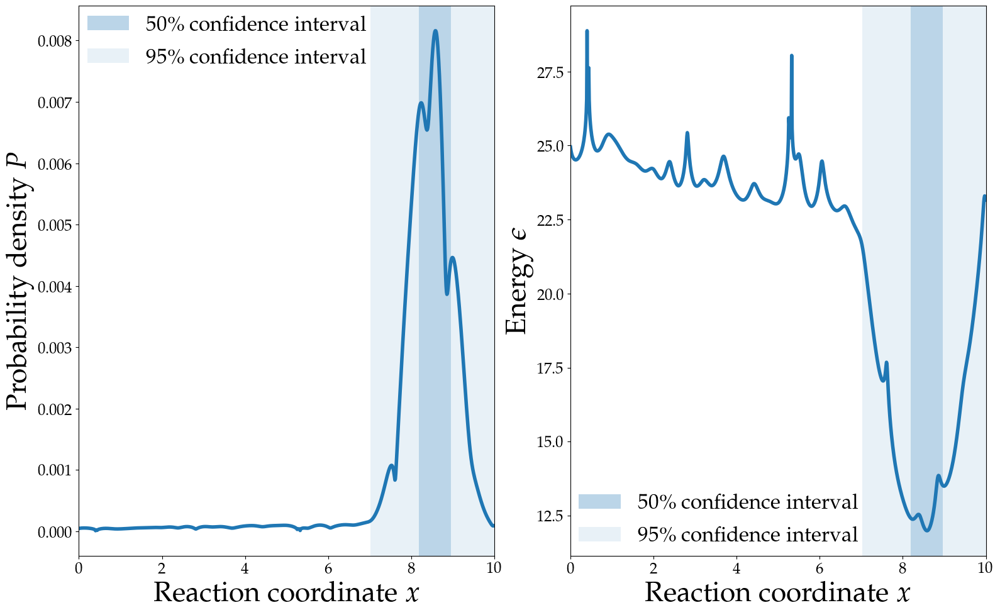

# Why am I here

Computational methods can be...

- Complementary to experiment
- Faster/cheaper than experiment
- More detailed than experiment

Though usually not at the same time

# Lets think statistically

## Protein structure forms according to a probability distribution

## Folded proteins have a funnel-shaped probability distribution {style="font-size: 22px"}

## Ready for some maths?

----

## The Boltzmann Distribution{style="font-size: 24px"}

[$$
    P_i = \frac{\exp(-\beta\epsilon_i)}{Z}
$$]{style="font-size: 50px"}

$P_i$ is the probability of state $i$ at equilibrium

$\exp(x)$ is the exponential function $e^x$

$\beta = \frac{1}{K_BT}$ incorporates the temperature

$\epsilon_i$ is the energy of state $i$

::: notes
What kind of energy $\epsilon_i$ is depends on how state $i$ is represented
- Free energy for coarse grained representations
- Hamiltonian for canonical ensemble in phase space
- Potential energy for canonical ensemble in configuration space
:::

. . .

[$$
    Z = \sum_{j}\exp(-\beta\epsilon_j)
$$]{style="font-size: 32px"}

## The Boltzmann distribution{style="font-size: 24px"}

## There are two problems

[$$
    P_i = \frac{
        \exp(-\beta\epsilon_i)
    }{
        Z
    }
$$]{style="font-size: 72px"}

1. Which states are most important
2. How important are those states

## Fast methods assume there is only one important state

So we just find the minimum energy state $i$

$$
    P_\mathrm{min} = \frac{
        \exp(-\beta\epsilon_\mathrm{min})
    }{
        \exp(-\beta\epsilon_\mathrm{min})
    } = 1
$$

. . .

Entropic effects must be part of the energy $\epsilon$

Energy function doesn't need much detail

# What happens if we don't make that assumption? {style="font-size: 24px"}

[$$
    P_i = \frac{
        \exp(-\beta\epsilon_i)
    }{
        Z
    }
$$]{style="font-size: 72px"}

We need to *sample* from the entire Boltzmann distribution with a detailed energy function

## Sampling is hard

### Levinthal's paradox

~50 KDa, 500 residue protein

Assume each residue is either α-helix or β-sheet

Looking for 1 folded state in 2^500^ (~10^150^) possible states

Yet, nature can do it

## Molecular dynamics

Calculate forces from the energy function ("force field")

Step the system through time with classical mechanics

Let the shape of the probability distribution guide your sampling

## Simulation is the method, not the goal

Kinetics are unreliable

Produces lots of noisy data

Humans are good at finding patterns

## Know what you're looking for

Just like experiments

:::::::::::::: {.columns}
::: {.column width="33%"}

>I'm looking for a non-crystallographic, highly populated state

>I'm looking for the important states in solution near the crystal structure

:::
::: {.column width="33%"}

>I'm looking for the folded state from an extended model or homology model

>I wanna measure the free energy of this process

:::
::: {.column width="33%"}

>I wanna measure the FRET efficiency in this state

>I wanna see if my crystal structure is stable in solution

:::
::::::::::::::

Make sure it's computationally feasible

## Check you've found it

Check everything seems reasonable

>The good, the bad and the user in soft matter simulations [@Wongekkabut2016Good]

Make sure it's not just a statistical fluke

>Best practices for quantification of uncertainty and sampling quality in molecular simulations [@Grossfield2018Best]

Run replicas

>Avoiding False Positive Conclusions in Molecular Simulation: The Importance of Replicas [@Knapp2018Avoiding]

## So

- We sample from the Boltzmann distribution
- Simulation is the method, not the goal
- Know what you're looking for
- Check you've found it

### Questions about sampling?

# Anyone want more maths?

A really nice way to think about entropy is only a few algebraic manipulations away!

## What *is* energy

$$
    P_i = \frac{
        \exp(-\beta\epsilon_i)
    }{
        Z
    }
$$

. . .

$$
    \exp(-\frac{1}{K_B T}\epsilon_i) = P_i Z
$$

. . .

$$
    -\frac{1}{K_B T}\epsilon_i = \log(P_i Z)
$$

. . .

$$
    \epsilon_i = - K_B T \log(P_i) - K_B T \log(Z)
$$

## What *is* energy

[$$
    \epsilon_i = - K_B T \log(P_i) - K_B T \log(Z)
$$]{style="font-size: 58px"}

. . .

$$
    \epsilon_{i\mathrm{rel}} = - K_B T \log(P_i)
$$

## What is entropy?

Suppose we have a state $i$ that comprises $\Omega_i$ microstates, each of probability $p_i$

$$
    P_i = \Omega_i p_i
$$

. . .

$$
    \epsilon_i = - K_B T \log(\Omega_i p_i) - K_B T \log(Z)
$$

. . .

$$
    \epsilon_i = - K_B T \log(\Omega_i) - K_B T \log(p_i) - K_B T \log(Z)
$$

## What is entropy?

Suppose we have a state $i$ that comprises $\Omega_i$ microstates, each of probability $p_i$

[$$
    \epsilon_i = - K_B T \log(\Omega_i) - K_B T \log(p_i) - K_B T \log(Z)
$$]{style='font-size: 32px'}

. . .

$$
    S_i = K_B \log(\Omega_i)
$$

. . .

[$$
    \epsilon_i = - T S_i - K_B T \log(p_i) - K_B T \log(Z)
$$]{style='font-size: 48px'}

. . .

In reality, not all the microstates have the same energy, but this is the gist.

## What's the difference?

$$
    \epsilon_i = - K_B T \log(\Omega_i p_i) - K_B T \log(Z)
    \\
    \epsilon_j = - K_B T \log(\Omega_j p_j) - K_B T \log(Z)
$$

. . .

$$
    \epsilon_i - \epsilon_j =  - K_B T \log(\Omega_i p_i) + K_B T \log(\Omega_j p_j)
$$

. . .

$$
    \epsilon_i - \epsilon_j =   - K_B T \log(p_i) + K_B T \log(p_j)
    \\ \qquad \qquad \qquad - K_B T \log(\Omega_i) + K_B T \log(\Omega_j)
$$

. . .

$$
    \Delta \epsilon =  \Delta[- K_B T \log(p)] - T \Delta[K_B \log(\Omega)]
$$

## Anyone recognise this?

$$
    \Delta \epsilon =  \Delta[- K_B T \log(p)] - T \Delta[K_B \log(\Omega)]
$$

. . .

$$
G = \epsilon
\\
H = - K_B T \log(p)
\\
S = K_B \log(\Omega)
$$

. . .

$$
    \Delta G =   \Delta H - T \Delta S
$$

## If you want more, check out stat mech!

# No more maths

I promise

# A quick run down of force fields

## What to look for in a force field

Can it model all the parts of my system?

Does it accurately produce the kind of data I'm looking for?

Has it been validated by people other than the authors?

Can I trust the parameters I have in the format I use?

## WARNINGS

Don't confuse force field and software!

Don't mix parameters from different force fields!

Most force fields are not parameterised for kinetics!

Most force fields are only parameterised at one temperature!

## CHARMM

CHARMM22*
: Extremely well validated force field for vanilla proteins. Reasonable accuracy even for IDPs and loop regions, despite not being parametrised for this. CHARMM22 modified by Shaw group.

CHARMM36m
: CHARMM36 modified for better performance with IDPs and loop regions. Distributed in many formats by the authors.

## AMBER

Great supplementary DNA and metallic ion parameters

AMBER99SB-*disp*
: AMBER99SB-ILDN with torsion and protein-water VDW optimisations by Shaw group. 4-point water model (slow). State-of-the-art IDP/loop accuracy (according to authors).

AMBER99SB*-ildn
: AMBER99SB with optimised torsions. Solid, widely used AMBER force field. Predates the IDP revolution. Several daughter force fields with improved performance.

## MARTINI

Coarse grained!

1000-fold faster than atomic MD

Converged MARTINI probably more accurate than unconverged atomic force fields

## Other stuff

GROMOS 54a7
: Great for arbitrary chemicals (ATB). Outdated for proteins.

OPLS 3e
: Schrödinger's proprietary force field. Claims experimental accuracy for binding free energies of arbitrary drug molecules to proteins. Expensive to license. Proteins under-validated.

## Questions about force fields?

# A few traps

## Use the same parameters as your force field authors

Read the paper!

Use same VDW cutoff range and method.

PME is usually OK if force field uses other long-range electrostatic treatment.

Use same water model.

Use same constraints (everyone breaks this rule and it might be OK)

## Thermostats and barostats

Don't ever use Berendsen thermostats or barostats in production!

## Thermostat

Just use Bussi's stochastic velocity rescaling thermostat for everything (`v-rescale` in GROMACS). Use a Nosé–Hoover chain if that's unavailable.

## Barostat

Use a Monte Carlo barostat if available (unless you really care about how the box changes shape). Coming soon to GROMACS.

If not, or if you care about box dynamics:

- Use Berendsen or Monte Carlo for equilibration
- Use Parrinello-Rahman or MTTK for production

## Step size

It's OK to make it as big as possible, as long as your simulation doesn't crash.

If your simulation crashes, try reducing the step size.

Atomic production simulations should never need to be below 1 fs, or 2 fs with constraints.

Adjacent frames are very similar - don't be afraid to drop them!

## Non-monovalent metal cations

Shape of orbitals is important IRL, but force fields are spherically symmetric!

Some work has been done on introducing virtual particles to correct this

## Box size

Smaller box lets you have less water and faster simulation

Too small box introduces finite size artifacts

Keep your periodic image distance larger than VdW cutoff

Rhombic Dodecahedral boxes have about 0.707 times the volume of a cubic box

Orientation of protein can change PI distance!

## Protonation state

Set at start of simulation.

If you're doing experiments near the P*K*~a~ of something, be careful!

## Enhanced sampling

Enhanced sampling is good.

Replica exchange is good.

Biased sampling methods are good if you have a good reaction coordinate.

Ensemble sampling methods will probably be good very soon.

Be careful with accelerated MD.

Make sure you should know what you're doing!

# Further reading
::: {#refs}
:::

---
references:
- id: Grossfield2018Best
  type: article-journal
  author:
  - family: Grossfield
    given: Alan
  - family: Patrone
    given: Paul N.
  - family: Roe
    given: Daniel R.
  - family: Schultz
    given: Andrew J.
  - family: Siderius
    given: Daniel
  - family: Zuckerman
    given: Daniel M.
  issued:
  - year: 2018
    month: 10
    day: 27
  title: Best practices for quantification of uncertainty and sampling quality in molecular simulations \[article v1.0\]
  container-title: Living Journal of Computational Molecular Science
  publisher: University of Colorado Boulder
  page: 5067-
  volume: '1'
  issue: '1'
  DOI: 10.33011/livecoms.1.1.5067
- id: Knapp2018Avoiding
  type: article-journal
  author:
  - family: Knapp
    given: Bernhard
  - family: Ospina
    given: Luis
  - family: Deane
    given: Charlotte M.
  issued:
  - year: 2018
  title: 'Avoiding false positive conclusions in molecular simulation: The importance of replicas'
  title-short: Avoiding false positive conclusions in molecular simulation
  container-title: Journal of Chemical Theory and Computation
  page: 6127-6138
  volume: '14'
  issue: '12'
  note: 'PMID: 30354113'
  URL: "https://doi.org/10.1021/acs.jctc.8b00391"
  DOI: 10.1021/acs.jctc.8b00391
- id: Braun2018Best
  type: article-journal
  author:
  - family: Braun
    given: Efrem
  - family: Gilmer
    given: Justin
  - family: Mayes
    given: Heather B.
  - family: Mobley
    given: David L.
  - family: Monroe
    given: Jacob I.
  - family: Prasad
    given: Samarjeet
  - family: Zuckerman
    given: Daniel M.
  issued:
  - year: 2018
    month: 11
    day: 30
  title: Best practices for foundations in molecular simulations \[article v1.0\]
  container-title: Living Journal of Computational Molecular Science
  publisher: University of Colorado Boulder
  page: 5957-
  volume: '1'
  issue: '1'
  DOI: 10.33011/livecoms.1.1.5957
- id: Wongekkabut2016Good
  type: article-journal
  author:
  - family: Wong-ekkabut
    given: Jirasak
  - family: Karttunen
    given: Mikko
  issued:
  - year: 2016
  title: The good, the bad and the user in soft matter simulations
  container-title: Biochimica et Biophysica Acta (BBA) - Biomembranes
  page: 2529 - 2538
  volume: '1858'
  issue: '10'
  URL: http://www.sciencedirect.com/science/article/pii/S0005273616300347
  DOI: 10.1016/j.bbamem.2016.02.004
  ISSN: 0005-2736
- id: Eastman2015Introduction
  type: Webpage
  author:
  - family: Eastman
    given: Peter
  issued:
  - year: 2015
  accessed:
  - year: 2019
    month: 11
    day: 7
  title: Introduction to Statistical Mechanics
  URL: https://peastman.github.io/statmech/

nocite: |
    @Braun2018Best; @Eastman2015Introduction
...
